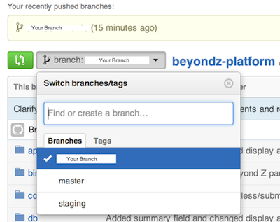

This is where Beyond Z participants login and access their leadership development portal.

# Getting Started

Follow this tutorial to get Rails setup for Heroku:
https://devcenter.heroku.com/articles/getting-started-with-rails4

You must install Postgres (http://postgresapp.com/)
and set your PATH in your ~/.bashrc:

	export PATH="/Applications/Postgres93.app/Contents/MacOS/bin:$PATH"

After your environment is setup, fork this repository on Github. Then in the location you want the local copy, run:

	git clone <your_forked_url>

To get all your gems, run:

	bundle install

## Configuration

In the "/env.sample" file is a list of environment variables that must be set for your database, SMTP, etc... to function properly. Copy this file to ".env"  and be sure these values are set for your Rails environment using your Foreman, Pow or preferred server setup.

### Creating a new Secret Token

	rake secret
	
Take the results of the above command and put this in your ".env" file for RAILS\_SECRET\_TOKEN.

## Running the Application 
From your repo directory:

	rake db:create
	rake db:migrate

And to start website on local machine, run: $foreman start and the app will be available at http://localhost:3000

## Code Management

Here is a nice description of the workflow we follow, which is also
detailed below:
http://nathanhoad.net/git-workflow-forks-remotes-and-pull-requests 

### Setup
To move on with development, run:

	git remote add upstream https://github.com/beyond-z/beyondz-platform.git
	
	
This makes the upstream (original repo) code available for merging into your local fork.

### Flow

Always create a new branch when working on a new feature. From your local master branch:

	git checkout -b <feature_name>

To commit all changes:

	git commit -am 'a brief message saying what you did. think about future readers.'

To push your local changes to your Github fork, run the static code analysis lint tool 
and the tests like this:

	rubocop .
	rake test
	git push origin <feature_name>

To submit a pull request and integrate your changes back to the main
repository do the following:

Select the feature branch from your Github page using the drop down selector. 

Then click the green pull request button to the left hand side of the drop down.

On the next screen, click "Edit" near the right-hand side of the screen.

Then choose the 'staging' branch of the beyondz-platform. 

Write a meaningful title and summary so it is well documented what this "feature" 
is when looking back or at a glance.  Your pull request will be rejected if the 
title and  summary is cryptic for other readers.

Finally, stay up to date by merging the staging repository back to your
local bracnh.

	git pull upstream staging

# Code style

We use standard Rails code conventions with some additional rules:

  * Indent each level with two spaces
  * Always raise subclasses of Exception specialized to your need, and always rescue a specific type.
  * Always use Rails database migrations when adding new data.
  * Write the main class at the top of the file. Try to stick to one class per file, but a small helper (e.g. an exception subtype) may appear below the main class.
  * Always use begin, raise, and rescue for error handling. Don't use throw and catch in Ruby.
  * Keep individual lines simple. If a new reader can't immediately tell what it is doing, either simplify the code or refactor it into a named method.
  * Use the flash hash to quick message workflows.
  * Never commit a FIXME: either fix it or make a task in Asana.

This is the full style guide we adhere to: https://github.com/bbatsov/ruby-style-guide

Remember to run rubocop before submitting pull requests to help keep
your code up to standards.
